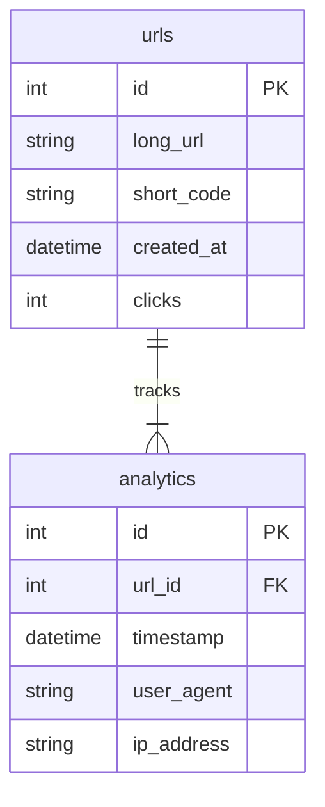

# 🧠 Monitoring a Containerized URL Shortener Webservice

## 📝 Project Overview
This project demonstrates monitoring and observability of a **containerized URL shortener microservice** using **Prometheus, Grafana, and Docker**.

The application consists of:
- A simple Flask-based URL shortener.
- SQLite database for storage.
- Prometheus metrics exporter.
- Grafana dashboard for visualization.

---
## 👥 Team Members

- Mohamad Alsaid Fawzi
- Mohamad Mahmoud Ragheb
- Mohamad Khaled Mohamad
- Mahmoud Osama Alsaid

---
## 📅 1. Project Planning

### 🎯 Objectives
- Build a containerized microservice that shortens URLs.
- Collect and visualize monitoring metrics (CPU, memory, request latency).
- Ensure scalability and maintainability through Docker and monitoring tools.

### 🧰 Tools & Technologies
| Category | Tools |
|-----------|-------|
| Backend | Flask (Python) |
| Database | SQLite |
| Containerization | Docker |
| Monitoring | Prometheus, Grafana |
| Version Control | GitHub |
| Visualization | Mermaid (for diagrams) |

### 🗓️ Project Timeline
| Phase | Task | Duration |
|--------|------|-----------|
| Planning | Define scope & architecture | 1 week |
| Development | Build URL shortener service | 2 weeks |
| Containerization | Dockerize and test | 1 week |
| Monitoring Setup | Configure Prometheus & Grafana | 1 week |
| Documentation | Finalize report & GitHub upload | 1 week |

---

## 🧑‍🤝‍🧑 2. Stakeholder Analysis

| **Stakeholder** | **Role** | **Interest** | **Influence** | **Responsibility** |
|------------------|----------|---------------|----------------|--------------------|
| **Developers** | Build & document system | High | High | Implementation & testing |
| **Instructor / Evaluator** | Assess project outcome | High | High | Evaluation |
| **End Users** | Use service to shorten URLs | High | Medium | Feedback & usability |
| **System Administrator** | Maintain uptime & monitoring | Medium | High | Deployment & health monitoring |

---

## 🏗️ Architecture Overview

```
                    +----------------+
                    |     Grafana    |
                    +--------+-------+
                             |
                             v
                    +----------------+
                    |   Prometheus   |
                    +--------+-------+
                             |
                             v
                +----------------------------+
                |  Flask URL Shortener App   |
                +-------------+--------------+
                              |
                              v
                       +-------------+
                       |   SQLite    |
                       +-------------+
```

---

## ⚙️ Setup Instructions

### 1. Clone Repository
```bash
git clone https://github.com/MOHAMADFAWZI-911/DEPI-PROJECT.git
cd DEPI-PROJECT
```

### 2. Build and Run Containers
```bash
docker build -t url-shortener-app .
docker run -d -p 5000:5000 url-shortener-app
```

### 3. Run Prometheus and Grafana
```bash
docker network create monitoring
docker run -d --name=prometheus --network=monitoring -p 9090:9090 prom/prometheus
docker run -d --name=grafana --network=monitoring -p 3000:3000 grafana/grafana
```

Then configure **Prometheus data source** in Grafana.

---

## 📊 Monitoring Endpoints

| Endpoint | Description |
|-----------|--------------|
| `/metrics` | Exposes Prometheus metrics |
| `/health` | Health check endpoint |
| `/shorten` | Creates short URLs |
| `/\<code>` | Redirects to original URL |

---

## 🧩 Database Design

### ER Diagram (Mermaid)


**Schema Explanation:**
- `urls`: Stores original and shortened URLs.
- `analytics`: Records click events, timestamps, user agent, and IP.

---

## 📈 Metrics Examples

Prometheus scrapes custom metrics like:
```
url_requests_total{endpoint="/shorten"} 10
url_redirects_total{short_code="abc123"} 5
app_uptime_seconds 1023
```

---

## 🧠 Observability Goals
- Track **URL usage** and **traffic trends**.
- Visualize data in **Grafana dashboards**.
- Ensure service **availability and health** through Prometheus alerts.

---
